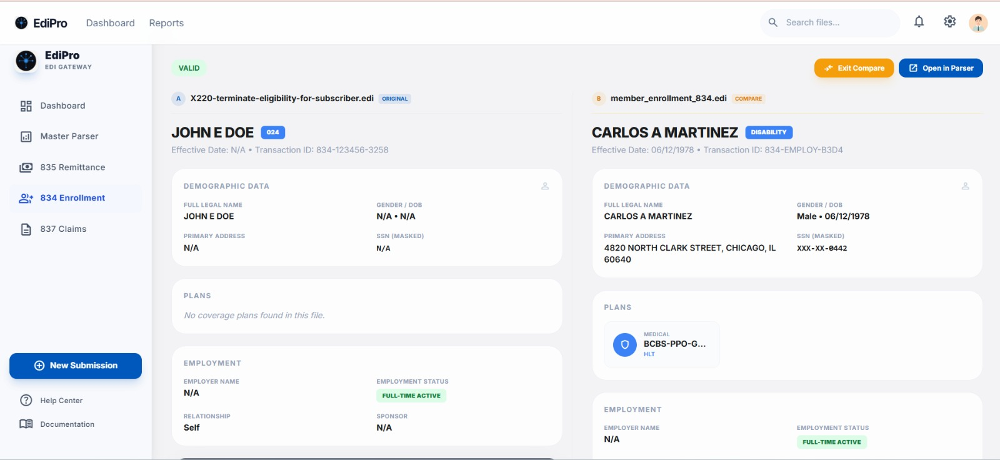
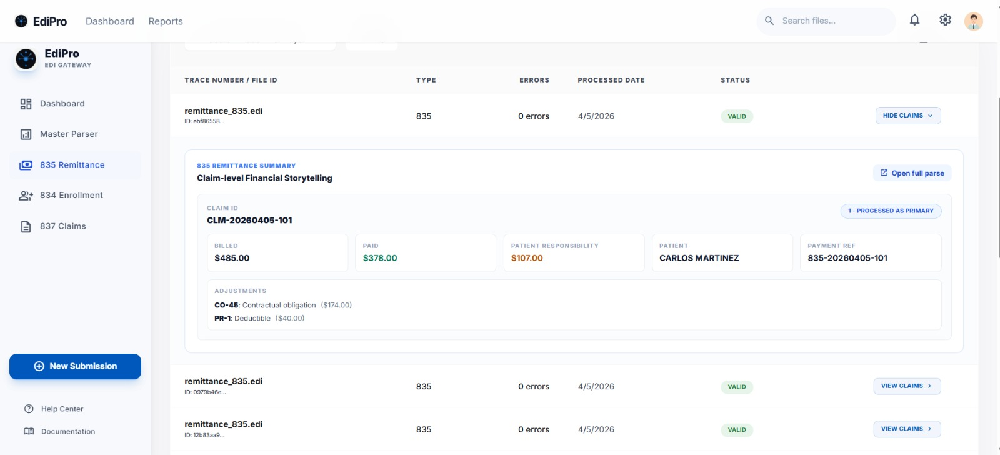
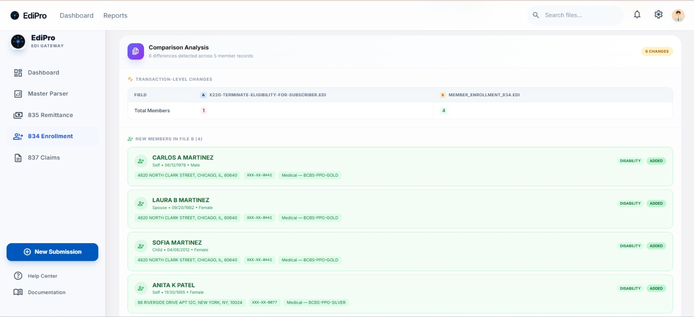
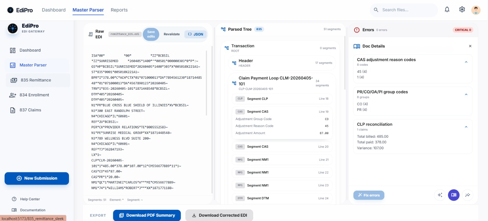
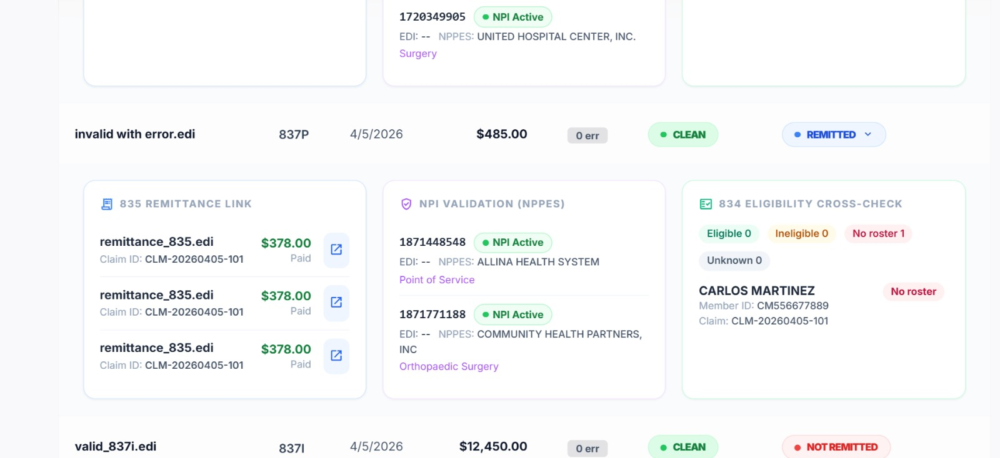
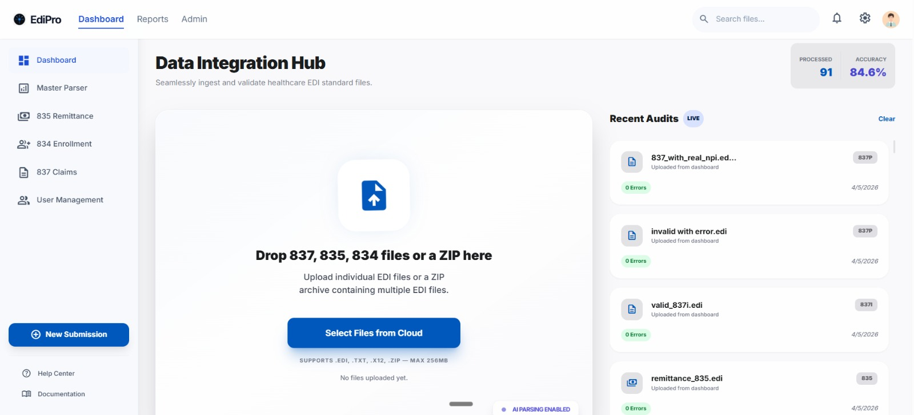

# EDIPRO

**End-to-end EDI processing platform for the US healthcare ecosystem.**

[-orange?style=flat-square)](#architecture)

EDIPRO eliminates the need to manually read or decode complex HIPAA X12 EDI transaction sets (837P, 837I, 835, 834). It automatically parses, validates, and extracts key information — claim IDs, NPI codes, patient details, service lines, diagnosis codes, and payment data — and flags errors before they cause claim rejections.

Built for anyone who works with X12 files: billing specialists, developers, and operations managers alike. No EDI expertise required — EDIPRO translates raw X12 syntax into clean, human-readable reports instantly.

---

## Table of Contents

- [Why EDIPRO](#why-edipro)
- [Architecture](#architecture)
- [Features](#features)
- [Supported Transaction Sets](#supported-transaction-sets)
- [Tech Highlights](#tech-highlights)

---

## Why EDIPRO

- **No manual decoding** — stop reading raw X12 segments line by line
- **Catch errors early** — missing segments, invalid NPIs, malformed loops, and incorrect qualifiers get flagged before submission
- **Three access points** — use it the way that fits your workflow, no forced adoption of a single tool
- **One platform, every transaction** — professional claims, remittance advice, and member enrollment all handled together

---

## Architecture

EDIPRO is built as a layered stack, designed for a clean progression from raw config to client-ready output:

| Layer | Role |
|---|---|
| **YAML** | Foundation — validation and parsing rules live as config, not code |
| **CRUD** | Sits on YAML — rules become dynamic and manageable at runtime |
| **LLM Summarization** | Sits on parsed output — makes results accessible to non-developers |
| **Audit Report** | Sits on everything — turns full output into a client/compliance-ready report |

---

## Features

### File Ingestion & Transaction Detection
Upload EDI files (`.edi`, `.txt`, `.dat`, `.x12`) via drag-and-drop or file picker. Auto-detects transaction type (837P, 837I, 835, 834) and displays envelope metadata.

### Structural Parser
Fully parses the loop hierarchy per HIPAA guidelines and renders an interactive, collapsible tree with human-readable element names.

### Validation Engine
Checks mandatory segments, element formats (NPI, ZIP, dates, amounts), qualifier codes, cross-segment consistency, and transaction-specific rules for 835 and 834.

### AI-Powered Error Report
Lists all errors and warnings with location, segment, element, and plain-English descriptions — plus an AI chat panel for contextual Q&A.

### Fix Assistant
Auto-suggests corrections for common errors. Users can accept a fix, which updates the structure and triggers immediate re-validation.

### 835 Remittance Summary
Claim-level breakdown of billed vs. paid amounts, patient responsibility, adjustment reason codes, and check/EFT reference.

### 834 Member Enrollment Summary
Tabular member roster with color-coded maintenance types, COB view, dependent rollup, and family enrollment grouping.

### Batch Processing
Upload a ZIP of mixed EDI files; generates a single consolidated validation report across all files.

### 835-to-837 Reconciliation
Matches claims by ICN/DCN across an 837 and its corresponding 835; shows payment vs. billed discrepancies side-by-side.

### 834 Change Delta Report
Compares two consecutive 834 files and surfaces net additions, terminations, and attribute changes per member.

### 834 Eligibility Cross-Check
Compares the 834 member roster against an 837 claims file; flags claims submitted for terminated or not-yet-effective members.

### Custom Rule Builder
A no-code UI for defining custom validation rules without touching the codebase.

### Export
Download parsed structure as JSON, error report as PDF, member roster as CSV, or the corrected EDI file with all accepted fixes applied.

### Real NPI Validation
Calls the CMS NPPES NPI Registry API to confirm an NPI is active and matches the provider name in the file. See the NPI Validation panel in the screenshot above.

---

## Supported Transaction Sets

| Set | Description |
|---|---|
| **837P** | Professional claims |
| **837I** | Institutional claims |
| **835** | Remittance advice |
| **834** | Member enrollment |

---

## Tech Highlights

- Config-driven validation rules (YAML)
- LLM-powered plain-English summarization and Q&A
- Live external validation via CMS NPPES NPI Registry API
- Batch and cross-file reconciliation support
